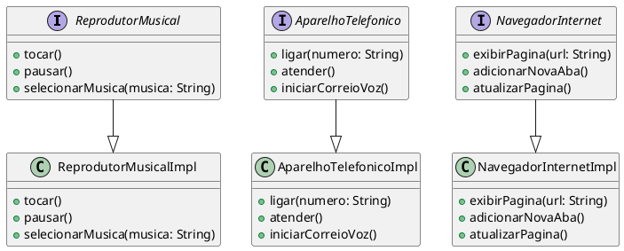

# iphone-uml-modeling

Este projeto tem como objetivo modelar e diagramar as funcionalidades do **iPhone (2007)**, incluindo **Reprodutor Musical**, **Aparelho Telefônico** e **Navegador na Internet**. A implementação foi realizada em **Java**, utilizando **Programação Orientada a Objetos (POO)** para representar as interações entre esses componentes.

## Funcionalidades

- **Reprodutor Musical**:
  - Métodos: `tocar()`, `pausar()`, `selecionarMusica(String musica)`
  - Representa a funcionalidade de tocar músicas no iPhone.
  
- **Aparelho Telefônico**:
  - Métodos: `ligar(String numero)`, `atender()`, `iniciarCorreioVoz()`
  - Representa as funcionalidades de realizar e atender chamadas, além de gerenciar o correio de voz.

- **Navegador na Internet**:
  - Métodos: `exibirPagina(String url)`, `adicionarNovaAba()`, `atualizarPagina()`
  - Representa as funcionalidades de navegação pela web.

## Estrutura do Projeto

```
phone-uml-modeling
│
├── src/
│   └── com/
│       └── iphone/
│           ├── components/
│           │   ├── ReprodutorMusical.java         
│           │   ├── ReprodutorMusicalImpl.java
│           │   ├── AparelhoTelefonico.java
│           │   ├── AparelhoTelefonicoImpl.java
│           │   ├── NavegadorInternet.java
│           │   └── NavegadorInternetImpl.java
│           │
│           ├── main/
│           │   └── IphoneApp.java
│           │
│           └── utils/
│               └── Logger.java
│
└── README.md
```

## Diagrama UML

O diagrama UML a seguir representa as interações entre as classes e suas funcionalidades.



### Explicação do Diagrama UML:
- **Interfaces**: São usadas para definir os contratos (métodos) que as classes concretas devem implementar. No diagrama, temos as interfaces `ReprodutorMusical`, `AparelhoTelefonico` e `NavegadorInternet`.
  
- **Classes Concretas**: As classes `ReprodutorMusicalImpl`, `AparelhoTelefonicoImpl` e `NavegadorInternetImpl` implementam as interfaces correspondentes e fornecem a implementação real dos métodos, como `tocar()`, `ligar()`, etc.

- **Associação**: As setas indicam que as classes concretas implementam as interfaces. Isso mostra a estrutura de herança e a relação entre interfaces e implementações.

## Tecnologias Utilizadas
- **Java 8+** para a implementação das funcionalidades.
- **UML (Unified Modeling Language)** para a modelagem das funcionalidades do iPhone.

## Como Rodar
1. Clone este repositório.
2. Compile os arquivos Java com o comando `javac`.
3. Execute a classe `IphoneApp.java` com o comando `java com.iphone.main.IphoneApp` para ver as funcionalidades em ação.

### Exemplo de Uso:
Ao executar o projeto, você verá a seguinte saída no console:

```
[LOG]: Iniciando o reprodutor musical...
Reproduzindo a música 'Bohemian Rhapsody'
Pausando a música...

[LOG]: Iniciando chamada telefônica...
Ligando para o número 123-456-7890
Atendendo a chamada...

[LOG]: Navegando pela internet...
Exibindo página www.apple.com
Nova aba aberta!
```

## Objetivo do Projeto

- Estudar e aplicar conceitos de **Programação Orientada a Objetos (POO)**.
- Criar diagramas UML que representam as funcionalidades de um dispositivo, como o iPhone, com base nas necessidades descritas.